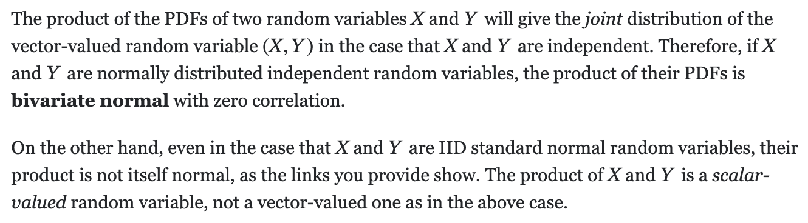

# Probability Distribution

Probabilistic models to explain neurons and behaviour.

Our world is stochastic (at least due to our lack of knowledge). It's even hard to predict the firing of the single neuron, thus we need to take into account the uncertainty.

Generative model - assumptions that you have about the observed data (world).

Random walks can model the information accumulation in decision making processes.

The categorical distribution is the multiple outcome extension of the Bernoulli, and the multinomial distribution is the multiple outcome extension of the binomial distribution.

How many times the neuron can fire within a certain time period? -> Poisson distribution.
Assumption - each spike is independent of the previous ones. Average firing rate is $\lambda$.

Examples using Gaussian distribution:

- Ask a subject to pointin the directionthat they heard a sound;
- fMRI activity from brain area

On the product of normally ditributed RVs.

First moment - expected value (average value in discrete case and $\int xp(x)dx$ in continuous one); second moment - variance (average value of squared differences between average and given value in discrete case and $\int x^{2}p(x)dx$ in continuous one).

# Statistical Inference

There are neurons in primary visual cortex that respond to different orientations of visual stimuli, with different neurons being sensitive to different orientations (Hubel and Wiesel in 1959).

Markov property - it encapsulates the important properties of the system based on its current state (any previous history doesn't matter, it's memoryless). Often, it is used as a simplification. $P_j = P_1T^{j}$, it is where eigenvalues and eigenvectors come from (stable state depends on them).

Unbiased estimation for sample variance is divided by $n-1$, not simply $n$ (though exactly the latter maximizes likelihood value)! As $E(s^{2}) = \frac{n-1}{n}\sigma^{2}$

Statistical inference: trying to infer what parameters make our observed data the most likely or probable.

Bayesian inference is just another way of how one can derive the "best" parameters. It is more applicable in case if
we know something about prior distribution of parameters (that $\mu$ and $\sigma$ values are drawn from pool of possible parameter values with specific probabilities - encapsulates some prior knowledge about the world). Here we maximize posterior value which is product of likelihood and prior value. Having a simple prior in the Bayesian inference process (blue) helps to regularise the inference of the mean and variance parameters when you have very little data, but has little effect with large data sets. If you have a prior/bias that is very wrong, your inference will start off very wrong.

In simple words, MLE is Bayesian inference assuming uniform distribution of parameters (no prior knowledge = all outcomes are equally probable).

Conjugate priors - posterior and prior distributions have the same shape (multiplying the prior with the likelihood just provides another instance of the prior distribution with updated values).

|  Prior   | Likelihood  | Posterior |
| :------: | :---------: | :-------: |
| Gaussian |  Gaussian   | Gaussian  |
|   Beta   |  Binomial   |   Beta    |
|  Gamma   |   Poisson   |   Gamma   |
|  Gamma   | Exponential |   Gamma   |

Bayesian inference gives you a full distribution over the variables that you are inferring, can help regularise inference when you have limited data, and allows you to build more complex models that better reflects true causality

"Bayesian brains" theory - it may be ideal for human brains to implement Bayesian inference by integrating "prior"
information the brain has about the world (memories, prior knowledge, etc.) with
new evidence that updates its "beliefs"/prior.

## Example: visual prior + auditory update.

In the first bonus task, individual has prior visual expectations on the location of the stimuli as well as update which comes as noisy auditory information. Having both types of sensory information as Gaussian distributions (try many trials and record feedback), we can update prior visual information with the respect to auditory update.

## Example: Bayesian Net.

Bayesian Net = belief network. Make inferences about multiple levels of information.
