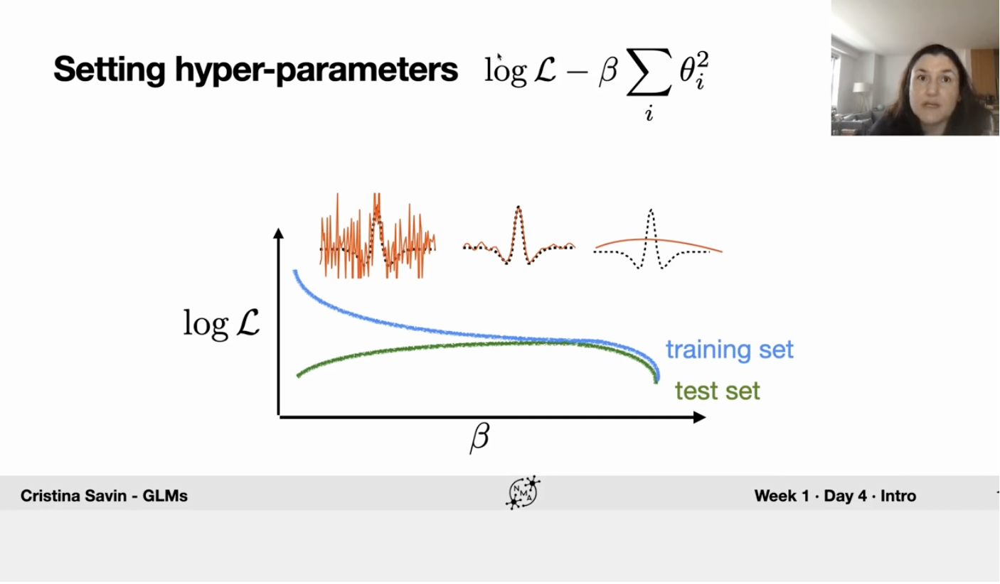

# Intro to GLM

GLM = Generalized Linear Models. Swiss Army Knife of Machine Learning algorithms. They are very useful if you want to study encoding (i.e., predict neural activity from external covariates) or decoding (i.e., predict a behavior or intention from neural activity). GLMs provide a baseline against which more complicated algorithms (e.g., deep nets) can be compared.

Mapping of stimuli (pixels on the screen, position of the animal's arm, position, speed and head direction) to neural response (discrete counts).

Mapping of other neurons to neural response of particular neuron (how population of neurons works).

Mapping of neural responses to decision (binary value, or in case of robotic arms - real values) - example of decoding task!

A common thread: multidimensional input (dimension x time) -> model -> scalar output (time). So, GLMs are mapping high-dimensional input to scalar!!

GLM: linear $\theta$ (filter = weights) + non-linear + noise (from exponential family). In fact, GLM are not linears (because of non-linearity in the middle). DIfferent GLMs solve different problems and we can go from the output type to untackle necessary blocks:

|     Output      |   Likelihood    |                  Non-linearity                  |    Type of Model    |
| :-------------: | :-------------: | :---------------------------------------------: | :-----------------: |
|   Real Values   | Gaussian Noise  |                Identity (linear)                |  Linear Regression  |
| Discrete Counts |  Poisson Noise  | Exponential (positivity contraint on $\lambda$) |     Poisson GLM     |
|  Binary Values  | Bernoulli Noise |                    Logistic                     | Logistic Regression |

Example:

1d input -> temporal filter (linear output, weight to the previous timesteps) -> logistic -> stochastic spiking -> spikes

---

stimulus -> stimulus filter -> nonlinearity -> stochastic spiking -> spikes (Poisson GLM, the most popular
in neuroscientific context)

More math on Poisson GLM: $P(y_t = t) = \frac{\lambda^{y} e^{-\lambda}}{y!}$ where $\lambda = e^{\theta^{T}x_{t}}$. $\lambda$ is the only parameter, it gives mean as well as variance. Log-likelihood is concave. Minimizing negative log-likelihood by gradient descent. Parameters are estimated with MLE with unique solution.

Too noisy output parameters - signature of overfitting. Regularization - adding penalty for large weights ($\log \mathcal{L} - \beta \sum_i \theta_i^{2}$)

Two different types of regularization. L2 - keep weights small, we want to shrink towards zero ($-\beta \sum_i \theta_i^{2}$), there is no feature selection, all are reduced gradually; L1 - encourage sparsity, we are more prone to find the solution on one of the axis making all theta's except one near zero, which is exactly the definition of sparsity ($-\beta \sum_i |\theta_i|$), it selects more informative features. Cross-validation for choosing the best $\beta$.

MLE + regularization = MAP estimate, with regularizer as prior. We had some prior knowledge (in regularization form) on parameters, then we observed data (likelihood) and obtain posterior parameters.

Most combinations don't have analytical solution and heavily rely on gradient descent. One notable exception is "ridge regression": linear Gaussian + L2 (lasso - L1). Then, the solution is:

$$
\theta^{*} = (x^{T}x + \beta I)^{-1}x^{T}y
$$

## Example: Retinal Ganglion Cell (RGC)

Model a retinal ganglion cell spike train by fitting a temporal receptive field. Temporal filetring model - the output is modeled via applied temporal filter on input variables (of some window size) and Gaussian noise. $X^{T}X$ is stimulus covariance, while $X^{T}y$ is spike-triggered average (STA). STA itself is also a popular estimator for filter (it simply takes average across all data windows). In average, $\theta_MLE$ is better than $\theta_STA$ but it involves inverse operation. Time window size $d = 25$ (about 200 ms) is a choice we're making based on our prior knowledge of the temporal window that influences RGC responses.

The experiment that produced these data used a white noise stimulus, there are no such correlations, thus correction term $X^{T}X$ isn't necessary here.

Linear GLM isn't that good here because our noise isn't Gaussian. For spike train encoding Poisson distribution is extremely powerful (how many events occur in the given time interval)? Firing rate is $\lambda = f(\theta^{T}x_{t})$. Most of the linear filters count the impact of the most recent stimuli positively and mostly while the previous ones are counted negatively. As the prediction, we will take exactly $\lambda$ as it is the expected value observing this data.

Output of logistic distribtuion perfectly works with Bernoulli distribution - we toss a coin and look on the outcome (not hard margin with 0.5) -> Bernoulli GLM. From MLE, binary cross-entropy comes. Here we use dataset where mice perceived Gabor stimuli and turned wheel to the left or right (from neural response, we will predict the direction). The model has almost three times as many features as samples. This is a situation where overfitting is very likely (almost guaranteed).

**Important Note**: Neuro data commonly has more features than samples. Having more neurons than independent trials is one example. In fMRI data, there are commonly more measured voxels than independent trials.

Never use a model as evidence for a phenomena when that phenomena is encoded in the assumptions of the model.
