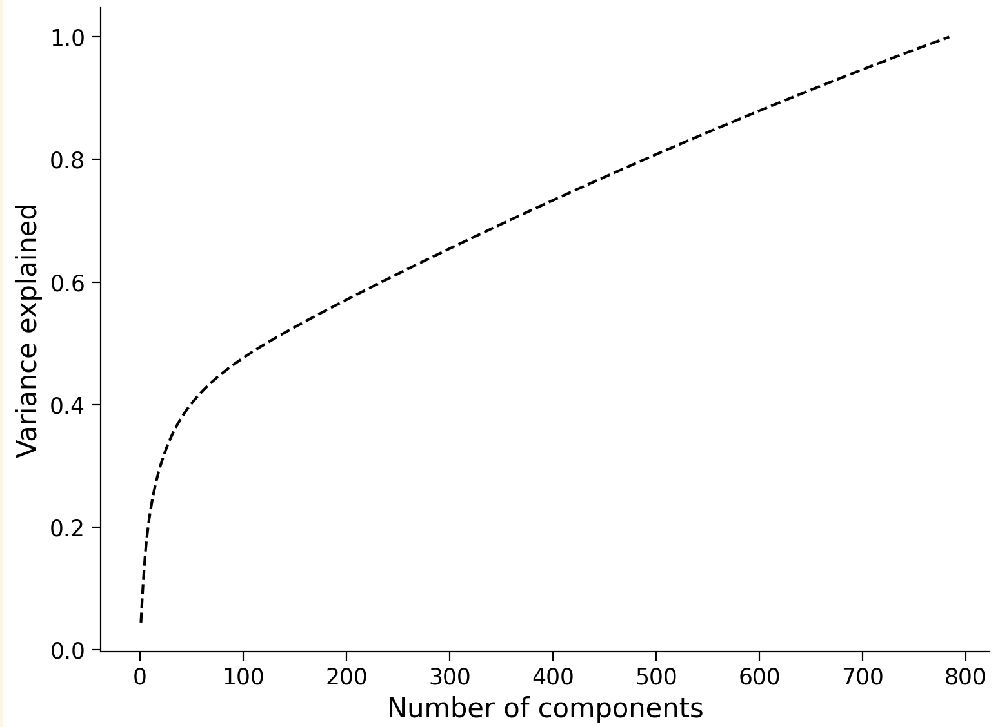

# Intro to Dimensionality Reduction

Investigate the possible underlying low-dimensional structure of neural population activity. Neuroscientists use it as a simple data analysis tool to compress data into a lower number of dimensions better suited for further analysis and modeling. We can also use dimensionality reduction to think about and investigate low-dimensional structure in the brain - whether it exists, how it is formed, and so on.

EEG, fMRI are high-dimensional data generators. We need to pull out the most relevant and important aspects of all that mess:) Rationale for dimensionality reduction is because neurons form networks, they are not independent (the brain has fewer degrees of freedom). Video analogy: describe the change of intensity in each of the pixel - it's going to lead to quite inefficient information, better to use a very small number of variables. Great example - video in low-resolution with noise, it's how it looks like from the brain. Temporal smoothing. Can we identify low-dimensional structure from noisy high-dimensional input? Dimensionality reduction as technique for visualization.

Examples where dimensionality reduction is useful: Single-trial analysis of neural population activity (whether all trials of the same task were +- the same?); Hypotheses about population activity structure; Exploratory analysis of large datasets.

PCA has no concept of observation noise; it's appropriate for trial-averaged analysis where we remove noise. Factor analysis (FA) - signle trial (identifies shared variance among the neurons; if neuron varies on its own, FA throws this variance out) but no temporal smoothing. Gaussian process factor analysis (GPFA) - has temporal smoothing and great for single trial. Latent dynamical system (LDS) - use if want to incorporate dynamical rules governing time-evolution of neural activity. Non-linear methods (Isomap, t-SNE, LLE) - use with care. Supervised methods (all considered before - unsupervised; LDA, dPCA), here we provide behavioural | stimulus | time information.

Multivariate = many variables. Collecting samples of many variables. Multivariate data has correlation of which we can make use and reduce the storage for the data. PCA - directions of maximum variance. If we have 2-dimensional data with N samples, we can have covariance matrix 2x2 where we calculate covariance of features, or NxN - covariance of each sample. Projection of the data on orthogonal basis decorrelates data.

Oh, lovely: dimensionality reduction: variables -> features! To make the difference between terms. Expectation - direction of the small variance represents noise. The biggest variance - direction of correlation. Mean subtraction in the very beggining is extremely important! Eigenvectors - "loadings", "weights". Projected data on eigenvectors - "scores" or "latent variables" and they are not correlated (they are zero-mean, as projected data is zero-mean, and then we use that eigenvectors are orthogonal)! PCA components = weights = eigenvectors. Latent space, latent representation Moreover, $var(s_i) = \lambda_i$.

Extrinsic (initial dimension) vs intrinsic (how many components) dimensionality. Without any additional information, intrinsic dimensionality isn't that easy to decide on: we don't whether it captures some importnat feature or whether it is only noise (or we are playing fractional dimensions game:). "Scree plot" - plotting eigenvalues in decreasing order. Somewhat opposite to scree plot - total variance explained. PCA: maximizing variance = minimizing error. PCA can be used for denoising data by removing noisy higher components. In MNIST, the weights corresponding to the first principal component appear to discriminate between a 0 and 1. Thus we expect pretty good clustering of zeros and ones while projecting even on the first component.

Whoa, salt-and-pepper noise (just changing pixel to the random value between 0 and 255 for defined fraction of them) changes total explained variance plot in the way so that, it doesn't actually saturate (image below). If one has the basis of not-noisy data, they can use it for sure for projecting and then reconstructing noisy! if not, noisy basis is also doing fine.

PCA can be used for compression, denoising (remove any noise which is orthogonal to the projected subspace), whitening | preprocessing (decorrelate + standardize data), visualization. There are a lot of others linear dimensionality reduction techniques, in parituclar: Probabilistic PCA (explicit noise model - Gaussian), Factor Analysis (different variance in different direcitons $x|y \equiv \mathcal{N}(yW^{T}, D)$), Linear Discriminant Analysis (LDA - great supervised method for classification as it preserves class discriminatory information). Blind source separation problem - mixture of different signals and we want to recover sources (typical task - EEG preprocessing), solutions: ICA (stronger condition than uncorrelated; basis vectors are not necessarily orthogonal), Nonnegative Matrix Factorization (NNMF) (when all data is positive -> weights and components are positive; finding basis vectors which frame data, not necessarily orthogonal).

Neural manifold - smooth low-dimensional structure in which datapoints are embedded in high-dimensional space. Non-linear dimensionality techniques try to find mapping on these embeddings (maybe points which are close together). t-SNE = t-distributed stochastic neighbour embedding (stochastic + no reconstruction + free parameter `perplexity` which balances local vs global information).
