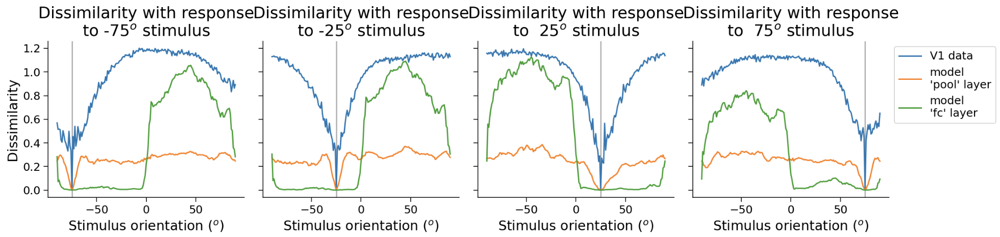

# Intro to Deep Learning

Both ANN and neural nets in brain process sensory information through stages. Synapses as equvivalence of parameters.

CNN: convolution + max-pooling + normalization. It has some resemblance to visual system. Flashlight metaphor: flashlight - filter/neuron/kernel; sliding motion - convolution; illuminated region - receptive field. Important: we can stack different convolution modules - tolerance to the spatial position of a picture or pattern. Later layers of ANN have enlarged receptive fields which allow them to discriminate the pattern independently of the location of that shape in the image. Each layer learns progressively more complex features. Backpropagation - the rule of learning.

**Neuroscience is a field of study that is used to study black box, like brains.**

Pipeline for estimating receptive fields (identify which regions of the image lead to high unit activations): sliding patch of noise was applied on all parts of the image -> discrepancy map. Interesting finding: in the network trained for scene (place) classification, there were more units as detectors for objects than in the network for classifying objects themselves. "Network dissection" toolbox.

ANN aren't just about finding repetitive patches but finding discriminative features that are relevant to the categorization task. Neural plasticity: how is the knowledge forgotten to solve new task.

Example with comparison of the brain and ANN image processing: dissimirality matrix for each of the images (118x118) for each of the patches (10000 let's say) and then RSA - representational similarity analysis, trying to match different matrcies from brain and ANN. Result - spatiotemporal maps of correlations between human brain and model layers.

# Decoding

Decoding: neural activity => external correlate.

Decode the orientation of the presented stimulus from the responses of the whole population of neurons. Data is captured via calcium imaging (360 stimuli and 20,000 neurons, stimulus is presented as orientation degree and neural data as normalized neural response). Deep learning is well-suited for this type of task (the data are very high-dimensional: the neural response to a stimulus is a ~20,000 dimensional vector. Many machine learning techniques fail in such high dimensions, but deep learning actually thrives in this regime, as long as you have enough data). Power of deep networks - fit complex functions.

Every network in Pytorch should have methods `init` and `forward`. `torch.Tensor` have some important attributes for automatic differentiation (as well as capability to parallelize code on GPUs). Nice property of ReLU - value of gradient is 1 (it is propagated fully as long as the input is positive, no problem with vanishing or exploding gradients). In reality, loss functions aren't convex and optimizers (or changing momentums) may help us to overcome this obstacle. `loss.backward()` - automatic differentiation, it's very powerful tool (can be used on any model in Pytorch). Note that the gradients of each parameter need to be cleared before calling `.backward()`, or else PyTorch will try to accumulate gradients across iterations (we may want to not clear it while considering accumulation over batches). Pytorch library is extremely flexible and proposes unified framework for training any model as long as its parameters and computations involve only `torch.Tensor’s`, and the model itself is differentiable.

What kinds of conclusions can we draw from these sorts of analyses? If we can decode the stimulus well from visual cortex activity, that means that there is information about this stimulus available in the visual cortex. Still, whether or not the animal uses that information to make decisions is not determined from an analysis like this.

Input/output transformations = expressivity. In practice, however, it turns out that increasing depth seems to grant more expressivity with fewer units than increasing width does (for reasons that are not well understood). It is for this reason that truly _deep_ networks are almost always used in machine learning, which is why this set of techniques is often referred to as _deep_ learning. The stochasticity induced by the extra random sampling step in SGD effectively adds some noise in the search for local minima of the loss function. This can be really useful for avoiding potential local minima, and enforce that whatever minimum is converged to is a good one.

# CNN

Convolution layers share weights (=reducing parameters number). "Output channel of convolutional filter", we may have many channels. In practice, we often have 3 input channels (RGB). Typical filters: center-surround (positive when edges), gabor (edges but orientation direction is important). Stride and padding - main parameters. Each unit computes a weighted sum over only a small patch of the input, referred to as the unit's receptive field. Pooling = stability w.r.t small translations (desirable for vision tasks).

Sensory pathways in the brain are massively parallel.

CNNs are of particular use while modeling visual system. We can qualitatively and quantitatively compare the representations we see in the model and in a given population of real neurons to hopefully tease out the computations it performs. Moreover, there is a natural hierarchy whereby layers closer to the network output represent increasingly more abstract information about the input image. This resembles primate visual systems, where neurons in higher-level visual areas respond to stimuli in wider regions of the visual field than neurons in lower-level visual areas. [The better a neural network model is at object recognition, the closer the match between its representations and those observed in the brain](https://www.pnas.org/doi/abs/10.1073/pnas.1403112111)

Hubel and Wiesel discovered simple cells, which would correspond to a unit with Gabor filters as well as some other cells depict activity that resemble center-surround filters.

# Encoding

Encoding: external correlate => neural activity (f.e. predict neural activity from image of stimulus)

While optimizing model's parameters to solve a particular visual task that we know the brain can solve, we refer to it as a "normative" encoding model, since it is optimized for a specific behavioral task. To evaluate whether normative encoding model is actually a good model of the brain, we'll analyze its internal representations and compare them to the representations observed in the mouse primary visual cortex. Since we understand exactly what the encoding model's representations are optimized to do, any similarities will hopefully shed light on why the representations in the brain look the way they do. We will evaluate similarity via RSA. Representational Dissmilarity Matrix (RDM) - compute (1-correlation; in can be derived analytically that we should compute z-scores for population of neurons for particular stimuli) between neural activities for each of the stimulus pairs (the same for activation patterns) and then correlation of these matrices - RDA. Power of RDA: mathc data from different modalities to common space.

Below is the picture which greatly reveals why there is more correlation between neural response of V1 area and max pooling level rather than with fully connected one; still neural response of V1 area is more disciminative I would say comparing to max pooling. Actually, this drastic change in fully-connected layer is due to the task itself we defined - it has the output of whether the stimulus is located to the left or to the right.

Visualization techniques include: tuning curves (response of one neuron to all stimulus) and dimensionality reduction for all population (PCA or t-SNE). In practice, one first use the step of PCA so that tSNE runs faster.

# More on Encoding and Decoding

An important thing to note in the code below is the `.detach()` method. The PyTorch `nn.Module` class is special in that, behind the scenes, each of the variables inside it are linked to each other in a computational graph, for the purposes of automatic differentiation (the algorithm used in `.backward()` to compute gradients). As a result, if you want to do anything that is not a `torch` operation to the parameters or outputs of an `nn.Module` class, you'll need to first "detach" it from its computational graph, and "attach" it on the CPU with the `.cpu()` method. This is what the `.detach()` and `cpu()` methods do. Example: `net.in_layer.weight.detach().cpu().numpy()`.

Smoothing with Gaussian filter. Possible regularization: L2 (weight decay, as we subtract value proportional to the weight itself) and L1 (more sparse solution and it is easier to interpret but it is harder to optimize), batch normalization (extremely important to consider in deep models), dropout, fewer neurons or fewer layers.

In neuroscience, we often want to understand how the brain represents external stimuli. One approach to discovering these representations is to build an encoding model that takes as input the external stimuli (in this case grating stimuli) and outputs the neural responses.
