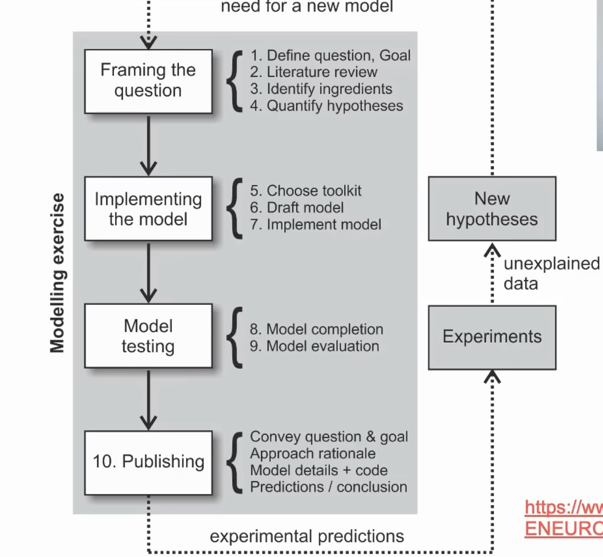

# Modeling Practice

Unfortunately, how to model is rarely, if ever, taught systematically (meta-science component). It's much easier to talk about toolkit, not the modeling per se (most tutorials assume you have the goal in mind). Today's guide proposes 10 steps on that matter to keep in mind and go through.

Model which simple fits the data doesn't provide any insight (where is the science?).

We won't go very far if we don't have the good question ("why | how | what"); bad question - answer "yes/no". More precise and narrow questions are better! (there shouldn't be any follow-up questions to make it more concrete).

Define and constraint modeling project (problem space). Goal - outcome space; and now we are ready to define model space. After experiments, clear communication (consice summary) in public space. In practice, we can have a lot of cycles redefining questions, toolkits and even phenomenons themselves. While having data analysis but not modeling, the steps are basically the same.

We don't know when we are done if we don't have clearly defined goals:)

Computational model - developing mechanisms for explaining phenomenon (or implementing hypothesis). Data neuroscience - test the computational model (or articulating relationship in the data).

It's all about the path, not the goal; as long as there is a learning process, the project is a success!

Toolkit pre-selection fallacy (deep learning, it may be meaningless curve fitting exercise:). Data fallacy ("data will tell me everything"; still we need good hypothesis!). No question, goal, hypothesis fallacy (where to start | end? when to publish?). Question should always come first, science is about questions and curiosity!!

Data analysis is basically "what" model.

Models don't exist in isolation with data (continuous interaction between models and experiemnts to generate data).

# 10 steps to keep in mind

1. Phenomenon, question, goal.

Articulation of what we want to do in the model. Toolkit is not the question. Question shouldn't be too vague (what specifically we would like to achieve). First question isn't going to be the final one:)

2. Literature review.

To understand the scientifice context in which we are doing the modeling. Google Scholar - great source to start with. Look at the citations of found papers (for even more literature). arXiv, bioArXiv, psyArXiv. Email authors directly on getting pdf. Backward (references in the paper) vs forward (who cited this paper) citations. PubMed. Connected Papers.

3. Model components.

Think what is typically measured in the experiment and what can be built from it. Consider what are the input and output parts and importantly, how are they connected.

4. Hypothesis.

Playing around isn't the choice: good hypothesis will guide data analysis (more detailed contraints for the model). We should be able to write hypothesis mathematically.

5. Choose a toolkit.

Right toolkit to address goals and hypothesis. Toolkit is linear algebra (with different implementations, f.e. numpy) or deep learning. Don't choose toolkit for toolkit's sake! It's important to stay on the same level of details as the question is (if we don't have neural data - it isn't that good to use SNN or so because we have a lot of variables we need to specify and which we don't have).

6. Draft model.

It is reasonable to draft the model before implementing it with all necessary details (what are the input and output values). Try to think about expected behaviour. The goal is to put in place all the components of the hypothesized relationships and explanations.

7. Implement model.

Try to test each of the components separately. Moreover, test whether all ingridients are actually important (do we need filtering? does it do something useful?).

Leak term in general can be implemented as $e -= ce$.

8. Model completion.

Whether model speaks about original hypothesis and answers the started questions. In order to understand that we are done, the goal should be clearly specified (not only answering the question, but rather some insight we obtain). Sometimes we don't need to improve the model any further.

9. Model evaluation.

Provide quantitative evaluation, not only "we noticed bla-bla". Even if there is no data to fit or to evaluate, we can think of reasonable ranges for parameters (natural constraints or the ones we derived playing with the model). Don't think the model is bad!! (on this stage ahah). The hypothesis may be wrong and model works as it is. It's a great idea to summarize what we have learned from the model.

Actually, by definition model is always wrong but we set up the level what is enough for us.

10. Model publishing.

Even if the hypothesis wasn't right, the summary is great to share! Think about the audience while telling the story about the made research.

## Example: Train Illusion

Our vestibular systems captures acceleration information. Our visual sense overrides vestibular.

Computational model question - "How do noisy vestibular estimates of motion lead to illusory percepts of self motion?". Data analysis question - "Does accumulated vestibular neuron activity correlate with self-motion judgements?".

## General Advice

For every modeling project, a very good exercise is to _**first**_ write a short, 100-word abstract of the project plan and expected impact. This forces focussing on the main points: describing the relevance, question, model, answer and what it all means very succinctly. This allows you to decide to do this project or not **before you commit time writing code for no good purpose**. Notice that this is really what we've walked you through carefully in this guide! 😀
