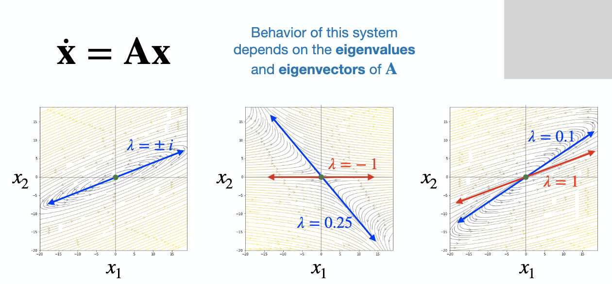

# Intro to Linear Systems

Brain is extremely dynamical system which can be viewed on different scales. Plasticity itself (the rules of how do we learn and how do the connections evolve over time) is also dynamically changed.

To describe the dynamical system, we need to list all possible values (including connectivity ones) that are changing over time, we should recognize the potential ranges where these variables live. State of the system is the point in this space; trajectory of system evolving - geometrical object in this space. Update rule: having particular place in the space, it tells us where the system will take place in the next time step (ODE -> iterative computational approach). Example: Hodgkin and Huxley - no one on Earth (at least now) can't solve the ODEs prepared by them; to show the potential correctness (capacity for generating spikes) they did computations instead.

# Linear Dynamical Systems

Dynamical systems: study of things which evolve in time. Brain - multi-scale structres as well as multi-scale dynamics in time. Differential equations are equations that express the rate of change of the state variable $x$. Linear systems are such that the function of the rate of change is linear:

$$
\dot{x} = \frac{dx}{dt} = Ax
$$

"Linear systems are all alike; every nonlinear system is nonlinear in its own way." Go with linear systems as long as you can and then only switch to nonlinear. When $a < 0$ - exponential decay; $a > 0$ - exponential growth. $x(t) = x_0 \text{exp}^(at)$ Behaviour on the system with 2 or more variables depends on the eigenvalues. Complex eigenvalues are extremely important for modeling cycling behaviour.

"Integration scheme" - Euler forward integration, Runge-Kutta, ...

To make things more interesting, we can make $a$ to be complex:) Then, real part is going to be responsible for growing | decaying while imaginary is frequency of oscillation. For really large values of the imaginary component, the numerical
integration scheme breaks down a bit, and we see non-stable oscillations even when real=0. This is a numerical artifact of the forward Euler scheme.

# Markov Processes

Here we will look at probabilistic dynamical systems. Markov property - knowledge of the value of the state variables $x$ at time t is all the information needed to determine $x$˙and therefore $x$ at the next time. Example: opening and closing of ion channels as random events (basis of action potentials). We can record potential by micropipette (voltage of open is smaller).

"Relaxation towards equilibrium" - when Markovian process arrives to the end distribution.

Continuous time formulation $\dot{x} = Ax$ is more about flow; discrete formulation $x_k+1 = Ax_k$ is more about jumping. Stable solutions are different, in the first case it is when $A = 0$, in the second $A = 1$. In the first case we look at two halfs of the plane for decay or growth behaviour, in case of the second one we look at the unit circle (inside - decay, outside - growth) and direcitons of eigenvectors are important here too. Whichever eigenvalue is 1 is the stable solution. Another eigenvalue, that is <1, decays and goes away after the transient period.

# Combining Determinism and Stochasticity

Dynamical systems with stochasticity: we know something but there is a place for stochasticity as well. Random walks in biology book:) Steps in random walks may be binary or may also be Gaussian. One of the simplest and best-studied living systems that has some interesting behaviors is the _E. coli_ bacterium, which is capable of navigating odor gradients on a substrate to seek a food source (his process is closely related to _Brownian motion_).

Diffusive process: the mean of the distribution is independent of time, but the variance and standard deviation of the distribution scale with time. In Gaussian random walk, variance is linear with time.

The Ornstein-Uhlenbeck (OU) process = Drift-diffusion model: DDM is a popular model for memory, which as we all know, is often an exercise in hanging on to a value imperfectly. We may define extra parameter in ODE, so that decaying process will head towards it, not zero.

$$
x_k+1 = x_\infty + \lambda(x_k - x_\infty) + \sigma \eta
$$

Drift term includes $x_\infty$ while diffusion one corresponds to stochastic part of the expression - $\sigma \eta$.

Mean value of DDM follows deterministic part while diffusion term introduces extra variance; it can be calculated as the following expression (at the equilibrium state):

$$
\text{Var} = \frac{\sigma^{2}}{1 - \lambda^{2}}
$$

The interplay between the deterministic and stochastic parts serve to balance the tendency of purely stochastic processes (like the random walk) to increase in variance over time. This behavior is one of the properties of OU systems that make them popular choices for modeling cognitive functions, including short-term memory and decision-making.

# Autoregressive Models

In general, we don't want to simulate data; instead, we would like to estimate parameters from the data. Assume such form of governing equation: $x_k+1 = \labmda x_k + \eta$. Plot of $x_k+1$ and $x_k$ will tell us about value of $\lambda$ (we expect to see it pretty linear with noise), so we solve regression problem for all these data points. We may want higher order autoregressive model: we need to include more history of the previous steps. With bigger amount of previously accounted steps, we will get better (as seeing more patterns) but doing so we can overfit!

Truly random sequences of numbers have no structure and should not be predictable by an AR or any other models. However, humans are notoriously terrible at generating random sequences of numbers! (Other animals are no better...)
